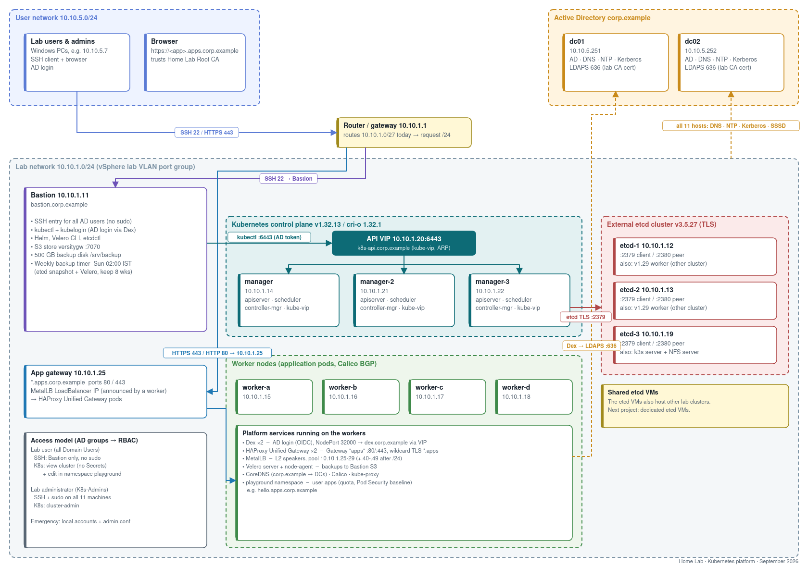

# From single-master lab to production-style Kubernetes platform

A hands-on build log and script collection: taking a **kubeadm lab cluster with one control-plane node**
and turning it into a **highly available, backed-up, Active Directory–integrated platform** with a modern
**Gateway API** ingress — on plain VMware VMs, no cloud load balancers.

> All IPs, hostnames and the domain in this repo are **example values** (`10.10.x.x`, `corp.example`).
> No secrets are stored here; keys and passwords are generated at run time and excluded by `.gitignore`.

## What was built

| Area | Outcome |
|---|---|
| **High availability** | 3 control-plane nodes behind a floating API VIP (kube-vip, ARP). Migrated a *running* cluster from a single-node endpoint to the VIP — re-issued API certs, moved kubelets, kube-proxy and `cluster-info` — with automatic rollback. Measured failover: ~1 s. |
| **External etcd** | 3-member TLS etcd cluster; weekly snapshots from the bastion. |
| **Backups & DR** | Velero (with file-system backup of volumes) to a self-hosted S3 store (versitygw) on a dedicated disk, plus etcd snapshots, on a weekly systemd timer. A scripted **restore drill** proves backups actually restore — including volume data. |
| **Time & DNS** | All hosts sync from the domain controllers (clocks had drifted up to 6 min); A/PTR records and a `*.apps` wildcard. |
| **Active Directory for Linux** | Every node joined to AD (realmd/SSSD); AD group–based SSH and sudo; Kerberos SSO between nodes. |
| **Active Directory for kubectl** | LDAPS enabled on the DCs with a small lab CA; **Dex** as OIDC provider; API server **structured authentication config** (CEL claim mappings) so every AD user gets a login; RBAC by AD group. |
| **Self-service namespace** | Every AD user can read the cluster and deploy into a quota-limited `playground` (Pod Security *baseline*, no NodePorts/LoadBalancers). |
| **Ingress, 2026-style** | Ingress-NGINX is retired — replaced with **MetalLB** (L2) + **HAProxy Unified Gateway** (Gateway API): one shared `Gateway`, wildcard TLS, users publish apps with an `HTTPRoute`. |

## Stack

Kubernetes 1.32 (kubeadm) · cri-o · Calico · kube-vip · etcd 3.5 · Velero 1.18 · versitygw · Dex 2.45 ·
MetalLB 0.16 · HAProxy Unified Gateway 1.0 · Gateway API 1.3 · Active Directory (SSSD, Kerberos, LDAPS) · chrony

## Access model

| Role | Who | SSH | Kubernetes |
|---|---|---|---|
| Lab user | every enabled AD account | bastion only, no sudo | `view` cluster-wide (no Secrets) + `edit` in `playground` |
| Lab administrator | AD group `K8s-Admins` | all hosts + sudo | `cluster-admin` |
| Emergency | local accounts | all hosts | `admin.conf` on the control plane |

User experience: `ssh <ad-user>@bastion` → kubectl is pre-configured on first login → the first `kubectl` asks for
the AD password once (OIDC password grant via kubelogin), tokens refresh for up to 7 days.

## Repository layout (run order)

| Folder | What it does |
|---|---|
| `01-access/` | Least-privilege `deployer` ServiceAccount + kubeconfig |
| `02-ha-control-plane/` | Prepare new managers, VIP migration (`vip-1..3`), failover test, rollback |
| `03-time-sync/` | chrony against the domain controllers |
| `04-backups/` | Backup disk, S3 gateway, Velero install, weekly timer, restore drill |
| `05-dns/` | PowerShell: A + PTR records with conflict detection and `-WhatIf` |
| `06-active-directory/` | DNS via DCs, realm join, Kerberos SSH, FQDN/SPN fix |
| `06-active-directory/kubernetes-login/` | Dex + LDAPS, API-server auth config, RBAC, bastion kubectl for AD users, bind-password rotation that works even when Dex is down |
| `07-gateway/` | MetalLB, HAProxy Unified Gateway, shared `Gateway`, demo app + route RBAC |
| `docs/` | Architecture diagram (PNG/SVG/draw.io + generator script), team brief |

## Lessons learned — the things that actually bit

1. **Check the router's subnet, not just the hosts'.** Every VM used `/24`, but the gateway routed only a `/27`.
   Load-balancer IPs above `.31` worked from the same subnet and silently timed out from everywhere else.
2. **Validate API-server auth config before a rolling restart.** `claims.groups.map(...)` fails CEL type-checking
   (`any` is not iterable) — it needs `dyn(claims.groups)`. A local `kube-apiserver` binary reproduces the error
   in seconds; a naive health check almost let two managers crash-loop.
3. **Health checks must prove the *new* container is healthy.** Waiting for `/readyz` right after editing a static
   pod manifest can hit the *old* process. Wait for a new container ID, then require sustained health.
4. **HAProxy sizes `memmax` from the container memory limit** — a 1 GiB limit breaks TLS with default `maxconn`.
5. **Helm post-install CRD jobs race the controller** — restart the controller once after first install.
6. **Dex expands `$VAR` in config values** — a `$` in a bind password silently breaks LDAP; set `DEX_EXPAND_ENV=false`.
7. **`realm join` with a short `hostname -f` registers only short SPNs**, so Kerberos SSO fails with
   "Server not found in Kerberos database". Fix `/etc/hosts` and register `HOST/<fqdn>`.
8. **Never make a repair tool depend on the thing it repairs** — the Dex password rotation writes via the control
   plane's local admin config, not via Dex-based kubectl.
9. **Prove the restore, not the backup.** The first drill "passed" for the wrong reason (the proof string lived in
   the pod spec); writing it only into the volume made the test honest.
